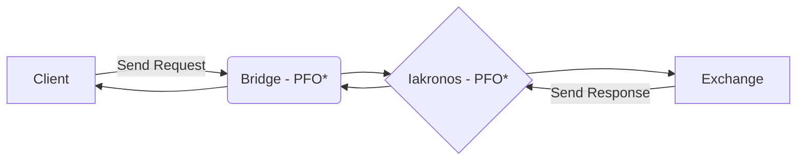

# PROPUESTA TÉCNICA IAKRONOS
## BENEFICIOS DE USAR EL SISTEMA DE IAKRONOS:
- Iakronos cuenta con un software desarrollado que facilita a los programadores a ejecutar todo tipo de consultas a diferentes Exchanges, para ser concretos, tenemos conexión con un total de [117 exchanges.](https://github.com/ccxt/ccxt/wiki/Exchange-Markets)
- Con unas simples consultas **REST** puedes conocer desde tus balances en Spot, Futures, Margin; hasta incluso recibir una lista con todas las órdenes que hiciste. Todas ellas especificadas en la documentación.
- Todas las consultas que se hacen a Iakronos pasan por una plataforma a la que nombramos [el bridge](https://bridge.iacronos.com/), qué, como su nombre indica, actúa de puente entre **el cliente** *(tú)* y todo el sistema de Iakronos. De esta manera, mediante unos filtros de permisos, seguridad y verificaciones de usuarios que procesa *el bridge*, todas las cuentas están protegidas y solamente **el cliente** tendrá acceso a ellas.
- Cómo mencionábamos arriba, **Iakronos** es el corazón de todo el sistema, nosotros ahorramos el trabajo a todos programador que quiera hacer cualquier petición a una Exchange. Y aprovechamos la tecnología de **el bridge** para garantizar seguridad, velocidad, y simplicidad a todos nuestros clientes.
- Gracias al **multiprocesamiento** y a las señales **asíncronas**, cualquier petición solicitada siempre será ejecutada y no se perderá; además, la velocidad en la que ejecuta las operaciones es increíblemente rápida.

## SEGURIDAD DE IAKRONOS
Estamos muy orgullosos de decir que Iakronos es una plataforma rápida, eficiente y sobretodo que es **muy segura**; no tendrás que preocuparte de que alguien pueda consultar tus balances, hacer órdenes por ti, o que te puedan robar las APIs. 

Vamos a explicar el proceso que tenemos montado *(si el cliente manda correctamente la request)* para garantizar la seguridad de nuestros clientes.


*PFO -- Process and Format Order

- El cliente manda una request al bridge.
- El bridge comprueba que el **user, name, account_id y la IP desde dónde se manda** es correcta, además de **la estructura del JSON**.
- Una vez chequeada, esa solicitud se procesa dentro del bridge, y añade y cambia valores al JSON para mandarle una solicitud a Iakronos. Esa solicitud está procesada con claves que solamente los desarrolladores tienen, además que solamente se pueden generar ese tipo de solicitudes desde el bridge y con los valores procesados.
- Iakronos chequea la solicitud y el JSON procesado por el bridge.
- Cuándo haya aprobado la solicitud, Iakronos aplica diferentes filtros según la solicitud requerida, y la manda al Exchange.
- La exchange ejecuta la solicitud, la manda a Iakronos. Por último, Iakronos se la manda al bridge y el bridge se encarga de mandarle los datos al cliente.

### Medidas para aumentar la seguridad:
- Asignar en el Exchange, a la hora de crear las APIs, la IP proporcionada a el cliente para que solamente puedan ejecutar solicitudes a la Exchange nuestro sistema.
- Proporcionarnos la IP desde dónde ejecutará solicitudes al bridge para configurarlo y que solamente esa IP pueda hacer consultas asociadas a ese user. *(próximamente)*


## EJEMPLOS DE CONSULTAS:
Imagina que quieres recoger los balances actuales de tu cuenta, para posteriormente hacer una operación. Y nosotros, después de que nos hayas proporcionado tus APIs y después de haberlas conectado a nuestra plataforma te hemos asignado el `account_id` 65.

En lugar de tener que descargarte las librerías para poder conectarte a tu Exchange, crear las órdenes, leer la documentación y manejar y filtrar los datos obtenidos, solamente **con saber hacer una solicitud requests** podrás obtener los datos.

Vamos a mostrar un ejemplo muy sencillo para hacer una solicitud con Python:

```
import json, requests
from config import name, psswd #archivo python dónde tienes almacenados tu user

# Url del bridge, que se encarga de procesar todos los datos
base_url = "https://bridge.iacronos.com/api/v1"
url_balance = "internal/balance/fetch"

def fetchBalance(name, psswd, url, account_id):
	"""
	@name identificador del cliente
	@psswd contraseña del cliente
	@url url a dónde mandarás la solicitud
	@account_id número de cuenta asignado
	"""
	# Creamos el JSON que mandaremos mediante solicitud requests
	dataJson = {
		"name":name,
		"psswd":psswd,
		"url":url,
		"account_id":account_id,
	}
	
	r = requests.post(url, data = json.dumps(dataJson), headers = {'Content-Type':  'application/json'})

	r.close() #para cerrar la solicitud requests, recomendado

	return r.content

print(fetchBalance(name, psswd, str(base_url + url_balance)) 	
```
*esto es sólo un ejemplo rápido*

Con esta solicitud, el print te devolverá un JSON similar al siguiente:
```
{
	"status": {
		"result": "OK",
		"message": "INTERNAL_BALANCE_FETCH"
	},
	"data": {
		"info": {
			"code": "200000",
			"data": [
				{
					"id": "62f68d306ab17900018d138e",
					"currency": "USDT",
					"type": "trade",
					"balance": "2013.43770411",
					"available": "2013.43770411",
					"holds": "0"
				},
				{
					"id": "62fdf7003ecb0c0001b8f0e2",
					"currency": "PAXG",
					"type": "trade",
					"balance": "0.00008157",
					"available": "0.00008157",
					"holds": "0"
				}
			]
		},
		"timestamp": null,
		"datetime": null,
		"USDT": {
			"free": 2013.43770411,
			"used": 0.0,
			"total": 2013.43770411
		},
		"PAXG": {
			"free": 8.157e-05,
			"used": 0.0,
			"total": 8.157e-05
		},
		"free": {
			"USDT": 2013.43770411,
			"PAXG": 8.157e-05
		},
		"used": {
			"USDT": 0.0,
			"PAXG": 0.0
		},
		"total": {
			"USDT": 2013.43770411,
			"PAXG": 8.157e-05
		}
	}
}
```
*dependiendo de la exchange a dónde sea la petición, o bien recibirás solamente los activos que tienes o recibirás todos los activos*

A partir de aquí ya puedes procesar a tu gusto los datos recibidos. En la documentación que te proporcionaremos, tendrás una explicado que hace cada URL y que datos tienes que mandar mediante JSON.

Cómo has visto, te hemos ahorrado mucho trabajo, desde preparar la conexión con la exchange que deseas, hasta procesar las órdenes para cada exchange que quieras vincular.
